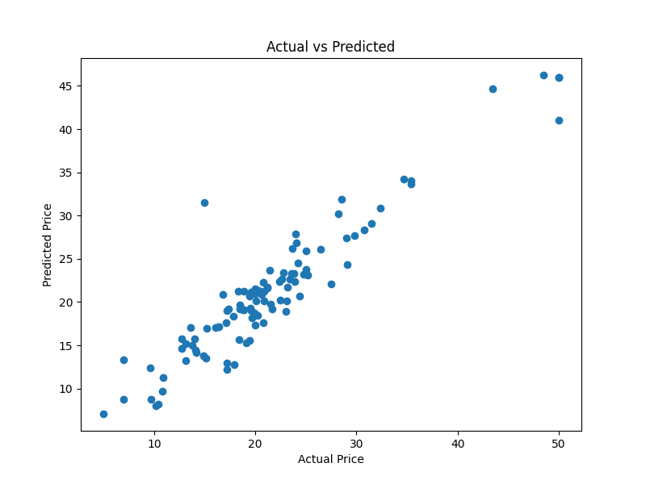

# Boston House Price Prediction

## Overview

This project predicts Boston house prices using Machine Learning techniques. The objective is to build a regression model that accurately estimates house prices based on various housing features such as crime rate, number of rooms, property tax, and other relevant factors.

---

## Dataset

- **Dataset:** Boston Housing Dataset
- **Target Variable:** MEDV (Median Value of Owner-Occupied Homes)

---

## Technologies Used

- Python
- Pandas
- NumPy
- Matplotlib
- Seaborn
- Scikit-Learn
- Joblib

---

## Machine Learning Workflow

1. Data Loading
2. Data Preprocessing
3. Missing Value Handling
4. Exploratory Data Analysis (EDA)
5. Correlation Analysis
6. Feature Selection
7. Train-Test Split
8. Model Training using Random Forest Regressor
9. Model Evaluation
10. Model Saving

---

## Machine Learning Model

- Random Forest Regressor

---

## Performance Metrics

| Metric | Value |
|---------|--------|
| MAE | 2.0677 |
| RMSE | 2.9431 |
| R² Score | 0.8819 |

---

## Project Structure

```text
Boston-House-Prediction/
│
├── dataset/
│   └── HousingData.csv
│
├── images/
│   ├── heatmap.png
│   ├── prediction.png
│   └── feature_importance.png
│
├── Boston_House_Prediction.ipynb
├── boston_house_model.pkl
├── requirements.txt
├── .gitignore
└── README.md
```

---

## Output

### Correlation Heatmap


### Feature Importance


### Actual vs Predicted Prices



---

## How to Run

1. Clone the repository.
2. Install the required libraries.

```bash
pip install -r requirements.txt
```

3. Open `Boston_House_Prediction.ipynb`.
4. Run all the cells sequentially.
5. The trained model will be saved as `boston_house_model.pkl`.

---

## Author

**Bhanu Teja**

ShadowFox AIML Intern
